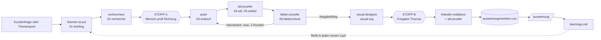

# Insight AI · Content-Flow für Claude Code

Ein wiederverwendbarer, KI-gestützter Ablauf, der aus Fragen mittelständischer Unternehmen geprüfte Fachartikel für insightai.co und LinkedIn-Beiträge für Thomas Weller macht. Spezialisierte Agenten übernehmen Recherche, Entwurf, Stilprüfung, Faktencheck und Grafik. Menschen geben an zwei Stellen frei.

Erstellt von Frederik Stoll als Vorschlag zur Werkstudentenstelle „Content & KI-Automatisierung", Stand 25.09.2026.

## Ablauf



## Schnellstart

```bash
# 1. Claude Code installieren (einmalig)
npm install -g @anthropic-ai/claude-code

# 2. Projekt öffnen
cd insight-content-flow
claude

# 3. In Claude Code
/themen 5                       # Themenpool erweitern
/artikel T2                     # Artikel zu Thema T2 aus dem Pool
/artikel "Reicht Copilot oder brauchen wir einen eigenen Assistenten?"
/linkedin content/2026-09-25-kosten-ki-assistent
/auswertung
```

`/agents` zeigt die sieben Agenten, `/skills` die Wissens-Skills.

## Beispiellauf

`content/2026-09-25-kosten-ki-assistent/` enthält einen kompletten Durchlauf zum Thema „Was kostet ein eigener KI-Assistent für Firmenwissen?" mit allen Zwischenständen. Darin sieht man, wie der Stilprüfer zehn KI-Floskeln aus dem Entwurf entfernt und der Faktenprüfer in Runde 1 fünf Stellen zurückweist (u. a. eine unbelegte Behauptung und eine stille Verschärfung), bevor er in Runde 2 freigibt.

## Aufbau

```
.claude/
  agents/          themen-scout, rechercheur, autor, stil-pruefer,
                   fakten-pruefer, visual-designer, linkedin-redakteur
  skills/
    artikel/       /artikel   – steuert den Gesamtablauf
    linkedin/      /linkedin  – drei Beiträge aus einem Artikel
    themen/        /themen    – Themenpool füllen und bewerten
    auswertung/    /auswertung – Kennzahlen → Regeln
    insight-stimme/     Tonalität + deutsche KI-Muster
    geo-artikel/        Aufbau für Google und KI-Assistenten
    linkedin-post/      Formate A/B/C, Timing, Verteilung
    avoid-ai-writing/   Anti-KI-Stil (übernommen, MIT)
  settings.json    Rechte: Web ja, kontext/ schreibgeschützt
CLAUDE.md          Grundregeln für jede Sitzung
kontext/           Einzige Quelle für Aussagen über Insight AI
themen/            Themenpool mit Bewertung und Status
content/           Ein Ordner pro Lauf
auswertung/        metriken.csv + learnings.md
```

## Designentscheidungen

| Entscheidung | Warum |
|---|---|
| Jeder Agent schreibt eine Datei | Nachvollziehbar, versionierbar in Git, jeder Schritt einzeln wiederholbar |
| Fakten-IDs (`<!-- F3 -->`) im Text | Der Faktenprüfer kann jede Aussage bis zur Quelle zurückverfolgen |
| Faktenprüfer sieht den Entwurfsverlauf nicht | Unabhängige Prüfung, das System bewertet sich nicht selbst |
| `[OFFEN: …]` statt Erfindung | Glaubwürdigkeit ist das Kapital eines Ein-Personen-Beratungsunternehmens |
| `kontext/` schreibgeschützt | Kein Agent kann Firmenfakten „anpassen" |
| Opus für Autor und Faktenprüfer, Sonnet sonst | Qualität, wo sie zählt, Kosten sparen bei Routine |
| Learnings-Schleife | Der Ablauf wird mit jeder Auswertung besser, statt statisch zu bleiben |
| Stopps statt Vollautomatik | Veröffentlicht wird unter dem Namen von Thomas |

## Herkunft der Bausteine

| Baustein | Quelle | Umgang |
|---|---|---|
| `avoid-ai-writing` | [wshobson/agents](https://github.com/wshobson/agents), ursprünglich [conorbronsdon/avoid-ai-writing](https://github.com/conorbronsdon/avoid-ai-writing), MIT | unverändert übernommen, deutsche Ergänzung separat in `insight-stimme` |
| Suchstrategie im `rechercheur` | Agent `search-specialist` aus wshobson/agents, MIT | Idee übernommen, neu auf Deutsch und auf Primärquellen geschrieben |
| Snippet-Regeln in `geo-artikel` | Agent `seo-snippet-hunter` aus wshobson/agents, MIT | Idee übernommen, um GEO erweitert |
| Idee eines Qualitäts-Editors | `content-quality-editor` aus [VoltAgent/awesome-claude-code-subagents](https://github.com/VoltAgent/awesome-claude-code-subagents), MIT | Nicht übernommen, weil es ein englisches CLI-Tool (unslop) braucht. Stattdessen `avoid-ai-writing` als reine Markdown-Lösung |
| Format der Agenten und Skills | [Claude-Code-Doku](https://code.claude.com/docs/en/sub-agents) | `skills:` zum Vorladen, `disable-model-invocation` für Befehle |

## Nächste Ausbaustufen
1. **Firmen-GitHub als Quelle.** Lesezugriff auf das GitHub von Insight AI, damit der Rechercheur Fragen an Thomas (Projektdauer, Ablauf, Datenquellen) selbst beantwortet. Regeln stehen in `CLAUDE.md`. Bis dahin bleiben diese Fragen `[OFFEN]` mit dem Zusatz „(per Firmen-GitHub klärbar)".
2. **Erstgespräche als Themenquelle.** Transkripte (mit Einverständnis) in `kontext/gespraeche/` ablegen, der Themen-Scout liest sie mit.
3. **Veröffentlichung.** Anbindung an das CMS der Website, sobald klar ist, wie sie gepflegt wird.
4. **Search Console und LinkedIn-Statistik** per Connector statt manueller CSV.
5. **Englische Fassung** über einen zusätzlichen Übersetzungs-Agenten, da die Website zweisprachig ist.
6. **Selbst auf Azure betreiben** als Referenzprojekt, wenn der Ablauf stabil ist.
